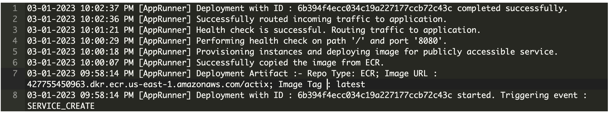

# Rust Project 2
by Yuxuan Yang (yy340)

## Description
This is an application for creating random fruit

This project creates a rust mini project to generate random fruits on front-end web page

This project also was deployed to aws Cloud9 conbined with actix microservice as application

## Containerized Actix Continuous Delivery to AWS app Runner

1. `cd myproject2`
2. build and run container via `make build` and `make rundocker`
3. push to ECR
4. Tell AWS APP Runner to deploy 

## Deployment

You can run this project directly on my deployment on AWS at 
https://56iuisbe3m.us-east-1.awsapprunner.com/

You may visit the version through 
https://56iuisbe3m.us-east-1.awsapprunner.com/health

You may visit and generate random fruit through
https://56iuisbe3m.us-east-1.awsapprunner.com/fruit

Please check the deployment on App:
